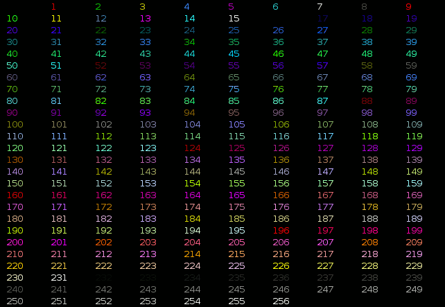
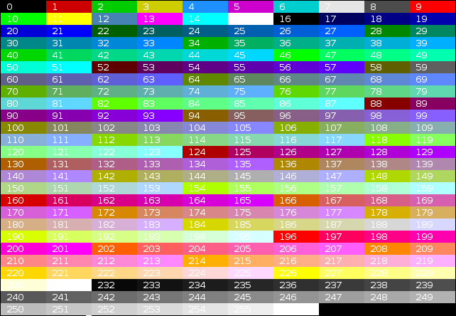

# Welcome to beaucli documenatation

## Installation

by pip
```sh
pip install beaucli
```
from source code
```sh
git clone https://github/com/memesterhub/beaucli
python setup.py install
```

## Methods

* `beaucli.fore` - Foreground shell colors/styles.
* `beaucli.back` - Background shell colors/styles.

## Description

basically beaucli is a tool for making your command line applications better by providing you colors and some extra tools

## Introduction

```py
import beaucli
print(beaucli.fore("Hello In Red!", "red"))
```

## Coming Soon!

* `colors by color code` - ability to put colors by color codes

# Foreground



# Background



* `beaucli.hidden_input` - Hidden Input function useful for passwords


